# Production RAG with Eval Pipeline

<p align="center">
  
</p>

A production-grade **Retrieval-Augmented Generation (RAG)** system that answers natural-language questions about **SEC 10-K filings** — with hybrid retrieval, reranking, and a RAGAS-based evaluation pipeline. Designed as a portfolio-ready project that separates quality RAG from naive vector search.

## Features

- **SEC 10-K ingestion** — downloads and parses 15 filings (AAPL, MSFT, GOOGL, AMZN, NVDA × 3 years) from SEC EDGAR
- **Hybrid retrieval** — BM25 (0.4) + dense vector search (0.6) fused via Reciprocal Rank Fusion (top-20 candidates)
- **Reranking** — `BAAI/bge-reranker-base` cross-encoder re-ranks top-20 → top-5
- **Answer generation** — local `qwen2.5:7b` via Ollama, with source attribution and refusal when context is insufficient
- **RAGAS evaluation** — faithfulness, answer relevancy, context precision/recall, judged by local Ollama by default or any free OpenAI-compatible API (OpenRouter/Groq/Cerebras) via `JUDGE_*` env vars
- **100% local & open source** — everything runs on your machine via Ollama + Docker; no cloud AI APIs (optional: judge may use a free hosted API for evaluation)
- **Streamlit UI** — chat interface with citations
- **Langfuse monitoring** — optional tracing (latency, cost, errors)

## Architecture

<p align="center">
  
</p>

```
User Query → Guardrails → Query Rewrite → Hybrid Retrieval (BM25 + Dense, RRF)
          → Rerank (top-20 → top-5) → Self-RAG gate → Generate (qwen2.5:7b) → Answer + Citations
```

Stores: **Qdrant** (vector DB + semantic cache), **Ollama** (embeddings `nomic-embed-text`, LLM), **SEC EDGAR** (source data). See [`SYSTEM_ARCHITECTURE.md`](SYSTEM_ARCHITECTURE.md) for full diagrams, [`TECHNICAL_DESIGN.md`](TECHNICAL_DESIGN.md) for component specs.

## Features (Phase 2 — complete)

- **API gateway** — FastAPI (`app/api.py`): `POST /query`, `POST /ingest`, `GET /health`, auth via `X-API-Key` (comma-separated `API_KEYS` env)
- **Semantic cache** — `src/cache.py`, Qdrant-backed, serves cached answers when top-1 cosine similarity ≥ `CACHE_THRESHOLD` (0.92); bypassed for the `baseline` strategy
- **Multi-tenant** — single `sec_filings` collection filtered by a `tenant_id` payload (`TENANT_ID` env, default `"default"`)
- **Incremental ingestion** — `scripts/ingest_one.py` ingests individual filings without recreating the collection

## Features (Phase 3 — complete)

- **Self-RAG (adaptive retrieval)** — `src/selfrag.py`: if the best `rerank_score` is below `SELF_RAG_MIN_CONFIDENCE` (0.3), re-retrieves with a wider `SELF_RAG_EXPAND_K` (40) and re-reranks; refuses to answer if still below `SELF_RAG_REFUSE_BELOW` (0.15). Active for `full`/`rerank` strategies.
- **Guardrails** — `src/guardrails.py`: blocks prompt injections, PII, and off-topic input; refuses bad output (`GUARDRAILS_ENABLED`).
- **Analytics dashboard** — Streamlit sidebar `View` toggle `Chat | Analytics` (chunk count, cache stats, session latency, A/B results).
- **A/B report** — `scripts/ab_report.py` turns `results_ab/scores_*` into `ab_report.md` (per-strategy/per-metric best).

## Evaluation Pipeline

<p align="center">
  
</p>

103 QA pairs across 5 tickers × 3 years, scored against 4 retrieval strategies (baseline, bm25_only, rerank, full) using RAGAS metrics. See [`RAG_EVALUATION.md`](RAG_EVALUATION.md) for methodology.

## Tech Stack

| Component | Technology |
|-----------|-----------|
| LLM | Ollama · `qwen2.5:7b` |
| Embeddings | Ollama · `nomic-embed-text` (768-dim) |
| Vector DB | Qdrant |
| Orchestration | LangChain |
| Retrieval | BM25 + dense (RRF ensemble) |
| Reranking | `BAAI/bge-reranker-base` |
| Evaluation | RAGAS |
| UI | Streamlit |
| Monitoring | Langfuse (optional) |

## Prerequisites

- Python 3.11+
- Docker Desktop (for Qdrant)
- Ollama installed with models pulled:
  - `ollama pull qwen2.5:7b`
  - `ollama pull nomic-embed-text`
- 16 GB+ RAM recommended (LLM runs locally)

## Quick Start

### 1. Start services

```bash
docker compose -f docker/docker-compose.yml up -d qdrant
# Ollama should be running too (native install or docker compose service, uncomment if used)
```

Verify:
```bash
curl http://localhost:6333/collections   # Qdrant
curl http://localhost:11434/api/tags     # Ollama
```

### 2. Install Python environment

```bash
python -m venv venv
venv\Scripts\activate            # Windows
source venv/bin/activate         # macOS/Linux
pip install -r requirements.txt
```

### 3. Configure `.env`

Create `.env` from the variables documented in [Configuration](#configuration) below (see `src/config.py`). `.env` is git-ignored — never commit secrets.

### 4. Ingest the corpus

```bash
python -c "from src.ingest import SECIngestor; print(SECIngestor().download_all())"
python -c "from src.chunker import DocumentChunker; from src.store import VectorStore; from src.config import config; import json; filings=json.load(open(config.processed_dir/'filings.json')); chunks=DocumentChunker().chunk_documents(filings); vs=VectorStore(); vs.create_collection(recreate=True); print('upserted', vs.upsert_documents(chunks))"
```

The first ingestion embeds ~40,000 chunks with `nomic-embed-text` on CPU — allow ~1–3 hours. Files land in `data/sec_filings/` and `data/processed/`.

### 5. Pre-download reranker models

Reranker weights download lazily on first use. Pre-fetch them to avoid a slow, easy-to-hang first run — a full `snapshot_download` pulls every file in the repo (e.g. `ms-marco-MiniLM-L6-v2` ships ~865 MB of redundant ONNX/OpenVINO/Flax/PyTorch copies):

```python
from huggingface_hub import snapshot_download

# ~1.1 GB BERT weights (single file, fetched as-is)
snapshot_download("BAAI/bge-reranker-base")

# cross-encoder: only config + weights + tokenizer, skip the 16 redundant copies
snapshot_download("cross-encoder/ms-marco-MiniLM-L6-v2", allow_patterns=[
    "config.json", "model.safetensors",
    "tokenizer.json", "tokenizer_config.json",
    "special_tokens_map.json", "vocab.txt",
])
```

Verified CPU load times once cached: `bge-reranker-base` ~12–15s, `ms-marco-MiniLM-L6-v2` ~11s.

### 6. Run the app

```bash
streamlit run app/streamlit_app.py
```

## Project Structure

```
├── app/                 # Streamlit UI + FastAPI gateway
├── assets/images/       # architecture & pipeline diagrams
├── docker/              # docker-compose (Qdrant, Ollama)
├── data/
│   ├── sec_filings/     # raw 10-K downloads (git-ignored)
│   ├── processed/       # parsed filings, chunk cache (git-ignored)
│   └── evaluation/      # eval datasets / results
├── src/
│   ├── config.py        # central configuration
│   ├── ingest.py        # SEC EDGAR 10-K download + parse
│   ├── chunker.py       # text chunking (1000 / 200 overlap)
│   ├── embed.py         # Ollama embeddings
│   ├── store.py         # Qdrant vector store
│   ├── cache.py         # semantic cache (Qdrant-backed)
│   ├── retrieve.py      # hybrid retrieval (BM25 + dense, RRF)
│   ├── rerank.py        # bge-reranker cross-encoder
│   ├── query_rewrite.py # query expansion
│   ├── selfrag.py       # adaptive retrieval gate
│   ├── guardrails.py    # input/output guardrails
│   ├── generate.py      # answer generation
│   ├── rag.py           # end-to-end RAG pipeline
│   ├── eval.py          # RAGAS evaluation
│   └── monitoring.py    # Langfuse tracing
├── tests/               # pytest suite
└── notebooks/           # analysis notebooks
```

## Configuration

All settings live in `src/config.py` and read from env vars (loaded from `.env`):

| Variable | Default | Purpose |
|----------|---------|---------|
| `OLLAMA_BASE_URL` | `http://localhost:11434` | Ollama server |
| `OLLAMA_EMBEDDING_MODEL` | `nomic-embed-text` | Embedding model |
| `OLLAMA_LLM_MODEL` | `qwen2.5:7b` | Generator (judge via `JUDGE_*` vars) |
| `JUDGE_MODEL` | `qwen2.5:7b` | Judge LLM (local Ollama) |
| `JUDGE_BASE_URL` / `JUDGE_API_KEY` | empty | Hosted judge endpoint (any OpenAI-compatible API, e.g. OpenRouter/Groq). Set key to switch |
| `QDRANT_HOST` / `QDRANT_PORT` | `localhost` / `6333` | Qdrant connection |
| `QDRANT_COLLECTION` | `sec_filings` | Collection name |
| `CHUNK_SIZE` / `CHUNK_OVERLAP` | `1000` / `200` | Chunking |
| `BM25_WEIGHT` / `DENSE_WEIGHT` | `0.4` / `0.6` | Retrieval weights |
| `INITIAL_K` / `FINAL_K` | `20` / `5` | Retrieve → rerank |
| `SEC_COMPANY_NAME` / `SEC_EMAIL` | — | SEC EDGAR user agent |
| `LANGFUSE_PUBLIC_KEY` / `LANGFUSE_SECRET_KEY` | — | Monitoring (optional) |
| `TENANT_ID` | `default` | Multi-tenant payload filter |
| `CACHE_ENABLED` / `CACHE_THRESHOLD` | `true` / `0.92` | Semantic cache on/off, similarity threshold |
| `API_KEYS` | — | Comma-separated static keys for the API gateway |
| `SELF_RAG_ENABLED` | `true` | Self-RAG adaptive retrieval on/off |
| `SELF_RAG_MIN_CONFIDENCE` | `0.3` | Rerank score below this triggers expand-and-rerank |
| `SELF_RAG_REFUSE_BELOW` | `0.15` | Refuse to answer below this score |
| `SELF_RAG_EXPAND_K` | `40` | Wider retrieval k for the Self-RAG expansion pass |
| `GUARDRAILS_ENABLED` | `true` | Input/output guardrails on/off |

## Testing

```bash
python -m pytest tests/
```

## Documentation

- [`PROJECT_REQUIREMENTS.md`](PROJECT_REQUIREMENTS.md) — scope, requirements, success criteria
- [`SYSTEM_ARCHITECTURE.md`](SYSTEM_ARCHITECTURE.md) — full architecture diagrams (Mermaid)
- [`TECHNICAL_DESIGN.md`](TECHNICAL_DESIGN.md) — component specifications
- [`RAG_EVALUATION.md`](RAG_EVALUATION.md) — RAGAS metrics & evaluation methodology
- [`ROADMAP.md`](ROADMAP.md) — phased delivery plan