# System Architecture

## High-Level Architecture

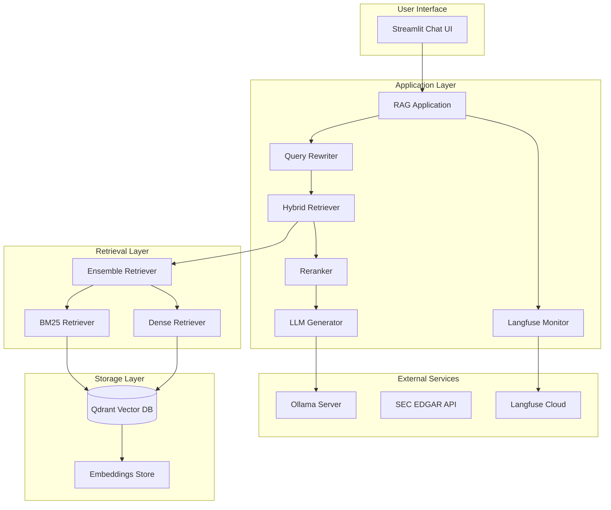

## Component Diagram

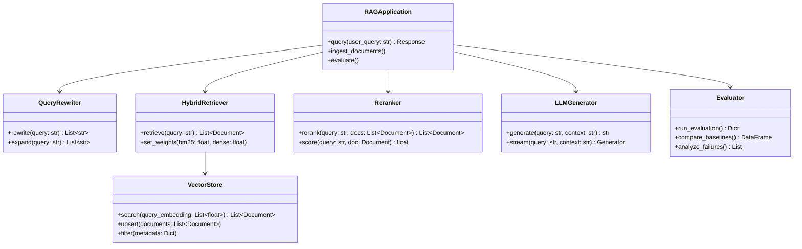

## Data Flow

### Ingestion Pipeline

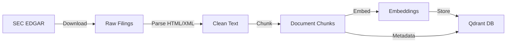

### Query Pipeline

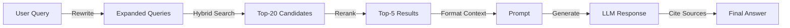

## Infrastructure

### Docker Compose

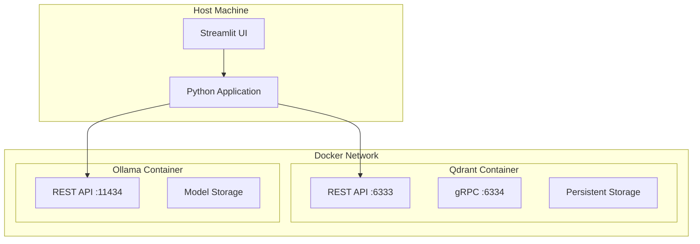

### Network Configuration

| Service | Port | Protocol | Purpose |
|---------|------|----------|---------|
| Qdrant REST | 6333 | HTTP | Vector DB API |
| Qdrant gRPC | 6334 | gRPC | Bulk operations |
| Ollama | 11434 | HTTP | LLM inference |
| Streamlit | 8501 | HTTP | Web UI |

## Technology Stack

### Core Components

| Component | Technology | Version | Purpose |
|-----------|-----------|---------|---------|
| LLM | Ollama + qwen2.5:7b | 0.5.7+ | Answer generation |
| Embeddings | Ollama + nomic-embed-text | 0.5.7+ | Vector creation |
| Eval Judge | Ollama qwen2.5:7b (default) or free OpenAI-compatible API (`JUDGE_*`) | 0.5.7+ | RAGAS metric judging |
| Vector DB | Qdrant | 1.13.0 | Vector storage |
| Framework | LangChain | 0.3.18 | Orchestration |
| Evaluation | RAGAS | Latest | Quality metrics |
| UI | Streamlit | Latest | User interface |
| Monitoring | Langfuse | Latest | Tracing |

### Python Dependencies

```
langchain==0.3.18
langchain-community==0.3.18
langchain-ollama==0.2.3
langchain-core==0.3.34
qdrant-client==1.13.0
ragas
streamlit
sec-edgar-downloader
rank-bm25
sentence-transformers
langfuse
python-dotenv
```

## Security Architecture

### Secret Management

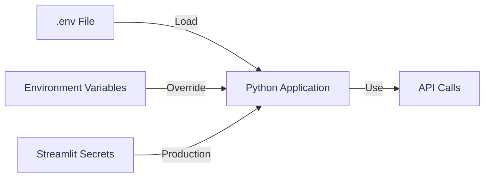

### Security Rules

1. **Never commit .env files** - Use .env.example as template
2. **API keys in environment** - Not in code
3. **No secrets in logs** - Sanitize all output
4. **HTTPS only** - For external connections
5. **Local inference** - No data leaves machine

## Performance Architecture

### Latency Budget

```
Total Query Latency: <500ms (target)

Query Rewriting:     ~100ms  (20%)
BM25 Retrieval:      ~50ms   (10%)
Dense Retrieval:     ~100ms  (20%)
Ensemble Fusion:     ~20ms   (4%)
Reranking:           ~150ms  (30%)
LLM Generation:      ~80ms   (16%)
```

### Caching Strategy

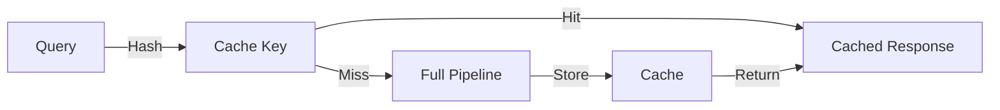

### Memory Management

| Component | Memory | Notes |
|-----------|--------|-------|
| Qdrant | ~500MB | Vector storage |
| Ollama Models | ~5GB | qwen2.5:7b + nomic |
| Python App | ~500MB | Application code |
| **Total** | **~6GB** | Recommended: 16GB |

## Scalability Considerations

### Current Scale
- 15 documents (5 companies × 3 years)
- ~5,000 chunks
- ~5,000 vectors
- Single user

### Growth Path
| Metric | Current | 10x | 100x |
|--------|---------|-----|------|
| Documents | 15 | 150 | 1,500 |
| Vectors | 5K | 50K | 500K |
| Storage | 100MB | 1GB | 10GB |
| Memory | 6GB | 8GB | 16GB |

### Scaling Strategies
1. **Horizontal**: Multiple Qdrant replicas
2. **Vertical**: Larger Qdrant instance
3. **Caching**: Redis for frequent queries
4. **Batching**: Async document processing

## Monitoring Architecture

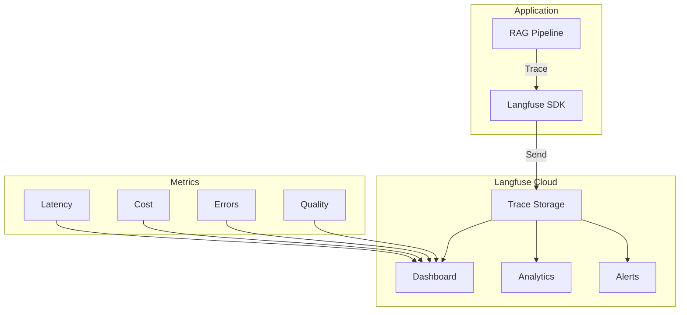

### Traced Events

| Event | Data Captured |
|-------|---------------|
| Query | Input, timestamp, user |
| Retrieval | Chunks, scores, latency |
| Generation | Prompt, response, tokens |
| Error | Exception, stack trace |

## Deployment Architecture

### Local Development

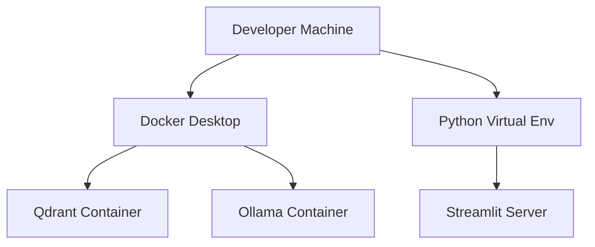

### Production (Streamlit Cloud)

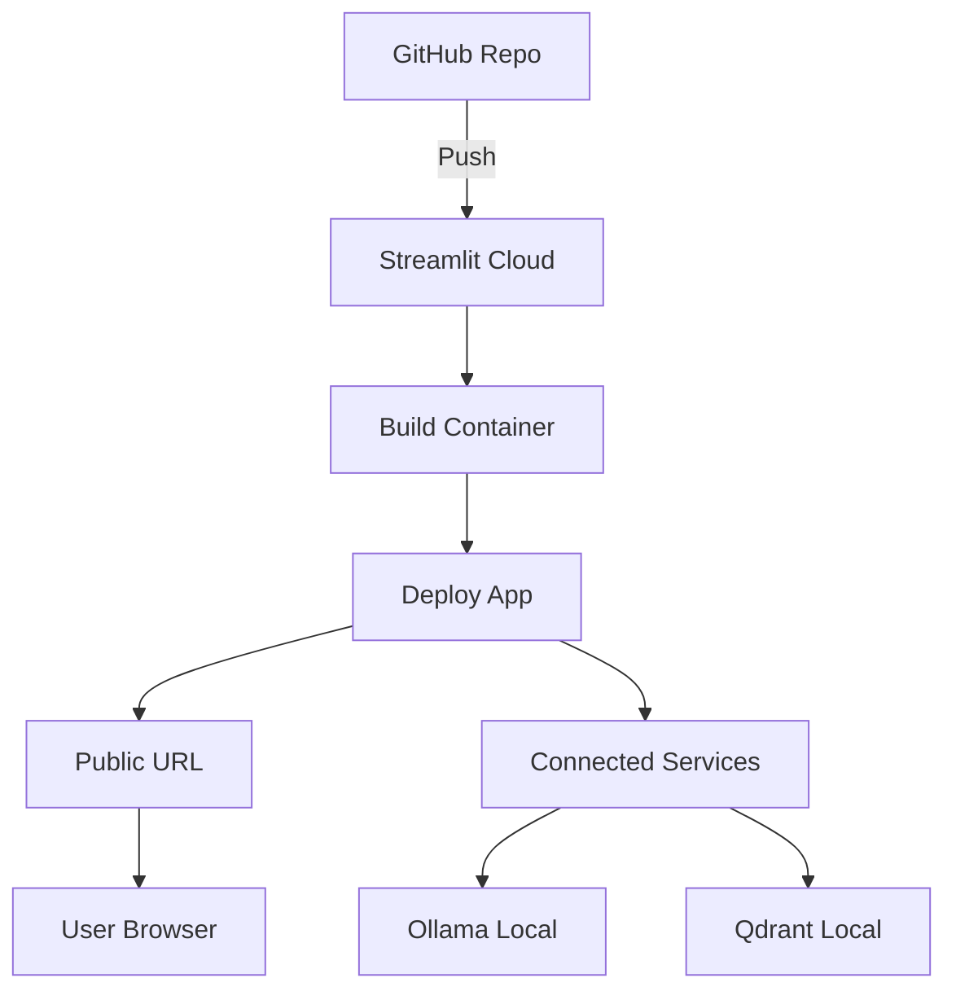

## Failure Modes

### Failure Detection

| Failure | Detection | Recovery |
|---------|-----------|----------|
| Ollama Down | Connection error | Restart container |
| Qdrant Down | Connection error | Restart container |
| Embedding Mismatch | Dimension error | Rebuild index |
| LLM Timeout | Timeout error | Retry with fallback |
| Memory OOM | Kill signal | Restart with smaller model |

### Fallback Strategy

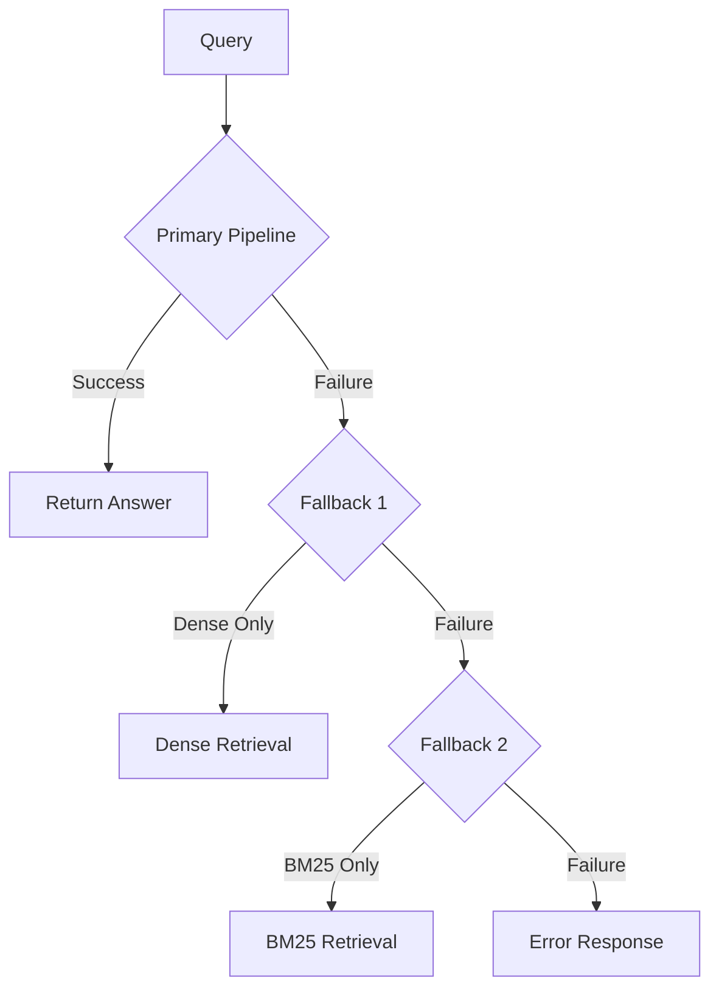

## Future Architecture

### Phase 2 Enhancements
1. **Multi-tenant**: User isolation
2. **Real-time Ingestion**: WebSocket updates
3. **Advanced Caching**: Semantic cache
4. **A/B Testing**: Framework for experiments

### Phase 3 Enhancements
1. **Self-RAG**: Adaptive retrieval
2. **Guardrails**: Content filtering
3. **Analytics Dashboard**: Advanced metrics
4. **API Gateway**: REST API for external access
